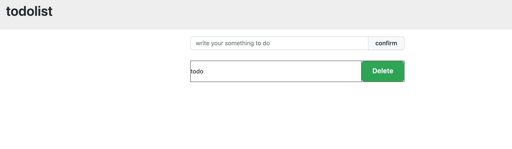
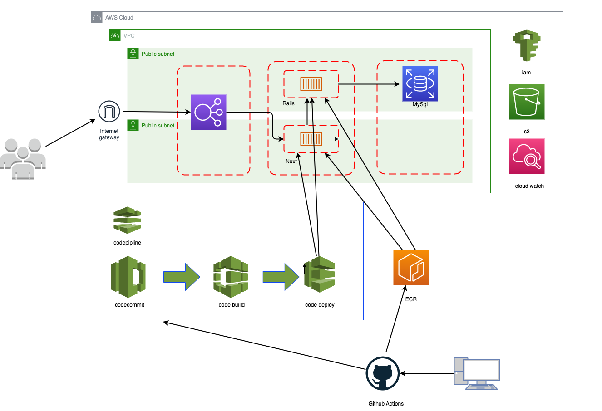

# 最高のTODOリストアプリ：RailsとNuxt3で実現

  

このTODOリストアプリは、RailsとNuxt3の最新技術を駆使して開発されました。従来のアプリとは一線を画す、驚きの速度と使いやすさを体感してください！

  

## 技術スタック
+ フロントエンド: Nuxt3
+ バックエンド: Rails
+ データベース: PostgreSQL
+ インフラストラクチャ: AWS

### インフラストラクチャ(AWS)
+ CloudWatch: ログ監視
+ CodePipeline: コードデプロイ
+ ECR: コンテナイメージレジストリ
+ ECS: コンテナオーケストレーション
+ ELB: ロードバランサー
+ IAM: アクセス管理
+ RDS: リレーショナルデータベース
+ S3: オブジェクトストレージ

## Qiita記事

技術詳細はQiitaに記載しています。

+ [RailsとNuxt3でtodoリストを作ろう[REST-API/Terraform/Fargate]〜その１、Rails基本設定編](https://qiita.com/sugiyama404/items/637900df3b533fd149f8)
+ [RailsとNuxt3でtodoリストを作ろう[REST-API/Terraform/Fargate]〜その２、Rails API編](https://qiita.com/sugiyama404/items/acea4cc38fe7f155ab54)
+ [RailsとNuxt3でtodoリストを作ろう[REST-API/Terraform/Fargate]〜その３、Nuxt.js編](https://qiita.com/sugiyama404/items/4e74c4446add5efc3669)
+ [RailsとNuxt3でtodoリストを作ろう[REST-API/Terraform/Fargate]〜その４、TerraformECS前編](https://qiita.com/sugiyama404/items/4e19ac1f9be6b8213f55)
+ [RailsとNuxt3でtodoリストを作ろう[REST-API/Terraform/Fargate]〜その５、TerraformECS後編](https://qiita.com/sugiyama404/items/d0e0e74628d38842c9bd)
+ [RailsとNuxt3でtodoリストを作ろう[REST-API/Terraform/Fargate]〜その６、Blue/Greenデプロイ前編](https://qiita.com/sugiyama404/items/1ffb4334b3a1546b4e23)
+ [RailsとNuxt3でtodoリストを作ろう[REST-API/Terraform/Fargate]〜その７、Blue/Greenデプロイ後編](https://qiita.com/sugiyama404/items/ea57e8c08156bf6eca46)
